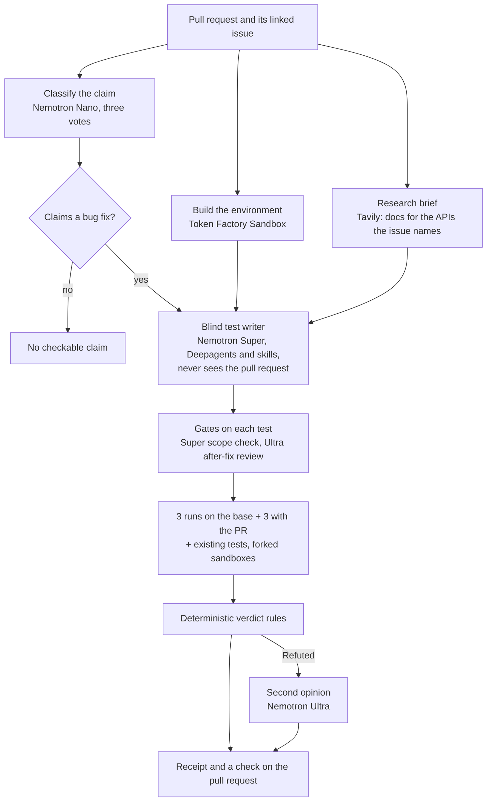
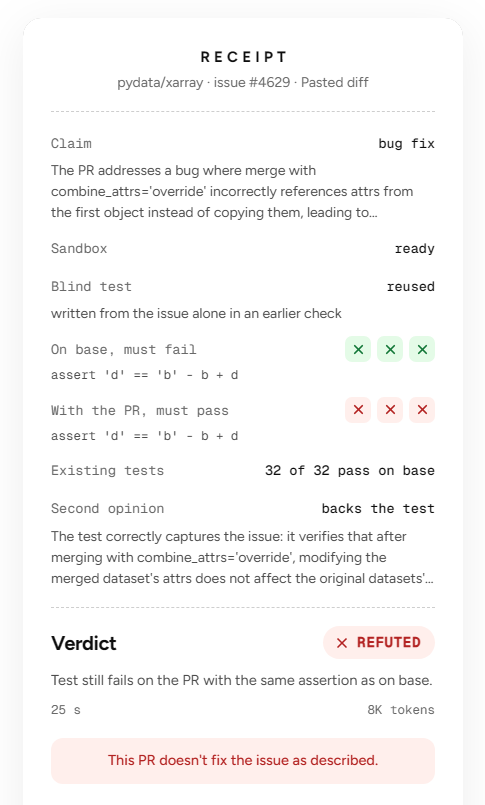

# Receipts

**Proof that a pull request does what it claims.** Receipts writes the missing test from the issue alone, runs
it before and after the change in Nebius Token Factory Sandboxes, and reports the evidence: Proven, Refuted,
Regression or Unproven.

[](https://github.com/Bhuvansai-16/Receipts-backend/actions/workflows/tests.yml)
[](LICENSE)
[](https://receipts-frontend-six.vercel.app/demo)

- **Live demo, no account:** https://receipts-frontend-six.vercel.app/demo (pick a pull request, watch the
  check run, read the receipt)
- **The app** (connect GitHub, check your own pull requests): https://receipts-frontend-six.vercel.app
- **Frontend code:** [Bhuvansai-16/Receipts-frontend](https://github.com/Bhuvansai-16/Receipts-frontend). This
  repository is the API and the agent.


## Why

A green CI check says the change broke nothing that was already tested. It does not say the bug is gone: the
case the issue reports usually has no test yet. More and more pull requests are written by AI coding agents,
and reviewers can't run every one by hand. Receipts gives a maintainer executed evidence in a few minutes, and
says nothing against a pull request on a guess: anything uncertain is Unproven, never Refuted.

## How a check works



1. **Claim.** Nemotron Nano reads the linked issue (or the pull request's own description) three times and the
   majority decides whether it claims to fix a bug.
2. **Environment.** The repository at the pull request's base commit is installed in a Token Factory Sandbox,
   while the claim is classified.
3. **Research.** Tavily fetches the library's own documentation for the APIs the issue names, from docs sites
   only, so the writer knows how to call them.
4. **Blind test.** A Deepagents agent on Nemotron Super gets the issue and a copy of the unpatched repository
   without git history, and writes one pytest file that must fail on today's code with an assertion. It never
   sees the pull request. Each submitted test passes code-checked gates: it runs on a clean copy, Nemotron
   Super checks it asserts only what the issue states, and Nemotron Ultra checks it would pass once the bug is
   fixed.
5. **Runs.** The accepted test runs three times on the original code and three times with the pull request,
   each in its own forked sandbox, together with the repository's existing tests.
6. **Verdict.** Plain rules, no model, decide the verdict from the runs. Before a pull request is called
   Refuted, Nemotron Ultra checks that the test matches the issue; if it doubts the test, the verdict is
   Unproven.
7. **Receipt.** The verdict, the test, every run's output and every command the agent ran, on a public page and
   as a check on the pull request.

A test written for an issue is kept: the next check of the same issue at the same base commit reuses it and
skips the writer. It was written without seeing any pull request, so it is fair to all of them.

## NVIDIA Nemotron on Nebius Token Factory

| Model on Token Factory | Role | Why this model | Typical tokens per check |
|---|---|---|---|
| Nemotron 3 Nano 30B A3B | Classifies the claim, three votes | Cheap and fast; a vote of three stopped one wrong "no claim" | about 3.5K |
| Nemotron 3 Super 120B A12B | Writes the blind test; scope check of each submitted test | A/B on five real pull requests: a valid test for 4 of 5 with half the tokens; Nemotron 3.5 Lightning managed none | about 21K |
| Nemotron 3 Ultra 550B A55B | After-fix review of each test; second opinion before any Refuted | Used only where a wrong call would accuse a contributor | about 3.6K |

Token counts are the averages of the six demo checks on 2 October 2026. Every model can be changed with an
environment variable (`MODEL_CLASSIFIER`, `MODEL_TEST_WRITER`, `MODEL_TEST_WRITER_STRONG`, `MODEL_SCOPE`,
`MODEL_JUDGE`).

## Where Token Factory helped

- **One key, three model sizes and the sandboxes.** The same `NEBIUS_API_KEY` reaches Nano, Super and Ultra
  through an OpenAI-compatible endpoint and runs the Token Factory Sandboxes, so each step uses the smallest
  model that does the job.
- **Forked sandboxes.** A built environment is a snapshot; the six verdict runs fork it and run at the same time
  (about 7 s for all six), and the agent works in its own copy. No GitHub token or secret ever enters a sandbox.
- **Environments kept across restarts.** A built environment is tagged in the Sandboxes, so a check after a
  server restart finds it in 7 s instead of rebuilding it in 38 s.
- **Cost you can see.** `scripts/usage_report.py` prices any receipt at Token Factory's list prices: a check
  costs about $0.013, or $0.004 when it reuses a test.

## Other services

- **Tavily**: the research brief. Before the writer starts, Tavily searches the library's documentation for
  the APIs named in the issue's code. Code hosts are excluded by Tavily and dropped again here, as are pages that
  show source code, so the brief can't leak the fix; the writer gets the text without links. The receipt shows
  how many pages it found, and the evidence lists them.
- **Neon**: Postgres for runs and kept tests, and Neon Auth for sign-in.
- **LangSmith**: a trace of every model call and agent step.
- **Render** runs this API, **Vercel** the web app.

## Verdicts

| Verdict | Meaning |
|---|---|
| PROVEN | The test fails on the original code with an assertion (3 of 3 runs), passes with the pull request (3 of 3), and the existing tests that passed still pass |
| REGRESSION | The test passes with the pull request, but existing tests that passed before now fail every time |
| REFUTED | The test still fails with the pull request, the same way (3 of 3), and Nemotron Ultra confirms the test matches the issue |
| UNPROVEN | Anything else. Explicitly not evidence against the pull request |
| NO_CHECKABLE_CLAIM | The pull request doesn't claim to fix a bug |

## What blind means

- The test writer never receives the pull request, nor SWE-bench's hidden tests or hints.
- It works in its own sandbox copy with `.git` removed; every verdict run forks the untouched original.
- The research brief only reads documentation sites, for names in the issue's code, and never passes on links.
- Remaining risks: documentation describes the latest release, which may already include the fix; the writer is
  told the docs show usage only and the issue decides what is correct. The sandbox has network access. Every
  command the agent ran and every source the brief used is in the evidence, so a leak can be audited.

## Results

### Measured against SWE-bench

199 patches for 40 SWE-bench Verified issues: each issue's real fix, an empty change, and patches from eight
published coding agents. SWE-bench's hidden tests label which patches really fix the issue; Receipts never sees
them. The same patches went to Nemotron Ultra with the issue and the diff, asked whether the patch fixes it.

| Out of the patches | Receipts | Nemotron Ultra reading the diff |
|---|---|---|
| Wrong patches passed as fixes | 10% | 46% |
| Wrong patches caught | 61% | 53% |
| Real fixes confirmed | 66% | 96% |
| Real fixes rejected | 9% | 4% |
| No answer (Unproven or unsure) | 28% | 1% |

$6.77 for all checks at list prices, $0.005 median per check. Two fixes came out of the misses: patches with
image files now apply, and real fixes refuted by a doubtful test fell from 7 to 2 on a replay. Full write-up,
per-repository numbers and every miss: [eval/RESULTS.md](eval/RESULTS.md),
[every row and trace on LangSmith](https://smith.langchain.com/public/aa3e7194-fe49-4c5a-8438-60dbb615a081/d) and
[the comparison on the site](https://receipts-frontend-six.vercel.app/). Run it: `python scripts/eval_run.py --mode receipts`.

### Optimizations

Measured on real services; the six demo cases are the live demo's real fix, empty patch and wrong patch for two
SWE-bench Verified issues (xarray 4629, requests 1142).

| | Before (1 Oct) | After (2 Oct) |
|---|---|---|
| Six demo checks, tokens | 355,938 | 169,862 (-52%) |
| Six demo checks, model cost at list prices | $0.139 | $0.080 (-42%) |
| A check that reuses a blind test | 50 s, $0.022 | 19 to 25 s, $0.004 |
| Pull request check after a restart | environment ready at 38 s | ready at 7 s |

Both columns give the same six verdicts. Details:
[optimizations results](docs/superpowers/specs/2026-10-01-agent-and-backend-optimizations-design.md#results-2-october-2026).



## Run it yourself

The quickest way is the [live demo](https://receipts-frontend-six.vercel.app/demo). To run a check on your
machine you need Python 3.12 and two settings from your Nebius account: a Token Factory API key and a
Sandboxes project.

```bash
git clone https://github.com/Bhuvansai-16/Receipts-backend && cd Receipts-backend
pip install -r requirements.txt
printf 'NEBIUS_API_KEY=...\nCONTREE_PROJECT=...\n' > .env   # your Token Factory key and Sandboxes project
python -m receipts run psf__requests-1142 --patch none
```

This checks a pull request that changes nothing against a real requests bug: expect REFUTED. On a clean machine
with only these two settings it took 1.5 minutes the first time, which includes downloading SWE-bench Verified;
the check itself took 40 s and 17K tokens. `--patch gold` checks the real fix (PROVEN), and
`--patch my.diff` your own diff. Optional settings: `TAVILY_API_KEY` adds the research brief,
`LANGSMITH_API_KEY` traces every step. The receipt is saved as JSON in `runs/`.

Tests: `python -m pytest -q`.

## Repository map

| Path | What it is |
|---|---|
| `receipts/engine.py` | The check: claim, environment, research, writer, runs, verdict, second opinion, test reuse |
| `receipts/writer.py` | The blind test writer: Deepagents middleware, its tools, the budget, the gates |
| `receipts/skills/` | Skills the writer reads when an issue needs them (exceptions, expected values, sympy, arrays, requests, plotting) |
| `receipts/verdict.py` | The verdict rules, plain code |
| `receipts/sandbox.py`, `receipts/targets.py` | Token Factory Sandboxes: pytest runs, patches, environments for GitHub repositories |
| `receipts/server.py`, `checks.py`, `github.py`, `demo.py` | The API, background checks, the GitHub App, the no-sign-in demo |
| `scripts/` | Evaluation on real pull requests, the credit report |
| `docs/superpowers/` | Design specs and plans, with measured results |

## Running your own

The API, Neon sign-in and database, the GitHub App and deployment are in [docs/SETUP.md](docs/SETUP.md).

## License

Apache-2.0. See [LICENSE](LICENSE).
