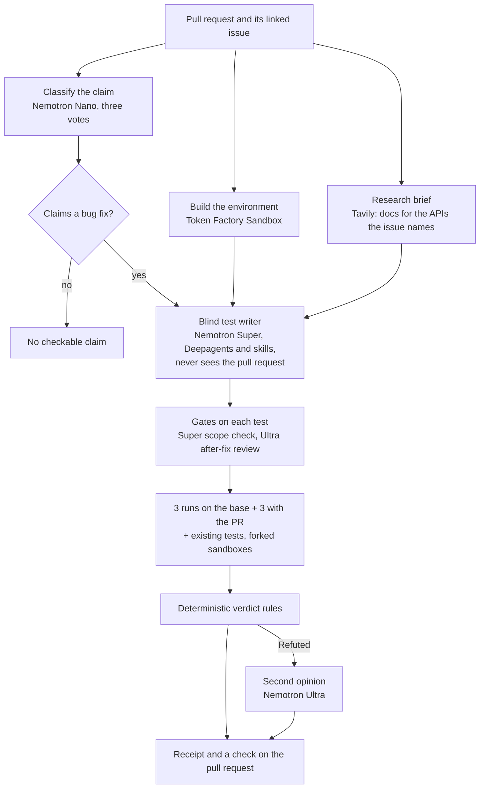

# Judge-ready repositories: implementation plan

> **For agentic workers:** REQUIRED SUB-SKILL: Use superpowers:subagent-driven-development (recommended) or superpowers:executing-plans to implement this plan task-by-task. Steps use checkbox (`- [ ]`) syntax for tracking.

**Goal:** A judge who only reads the repositories understands Receipts, sees how it uses NVIDIA Nemotron on
Nebius Token Factory and Tavily, can try it with two keys, and finds green tests; the receipt shows the Tavily
docs it used.

**Architecture:** Documentation rewrite (backend README as the entry point, detailed self-hosting moved to
`docs/SETUP.md`), one small frontend feature (a "Docs" line on the receipt), GitHub Actions in both
repositories, screenshots from the live site, and one real two-key run to prove the quick start.

**Tech Stack:** Markdown with Mermaid (GitHub renders it), GitHub Actions, React 19 + Vitest, Python 3.12 +
pytest, headless Microsoft Edge for screenshots.

**Spec:** `docs/superpowers/specs/2026-10-02-judge-ready-repos-design.md`

## Global Constraints

- Copy: plain words, no em dashes, no marketing words; every number in a README comes from a measured run
  (`docs/superpowers/specs/2026-10-01-agent-and-backend-optimizations-design.md` results).
- Never put keys or `.env` values in any file, command line or output.
- Backend tests: `python -m pytest -q` (257 pass). Frontend: `npx vitest run` and `npm run build`.
- Commits end with `Co-Authored-By: Claude Opus 5.5 <noreply@anthropic.com>`. Push both repositories only in
  Task 6 (a backend push redeploys Render).

## Review Focus

1. A receipt whose research found nothing, or a reused test (no research at all): no Docs line (Task 1 tests).
2. Old receipts stored before `research` existed in evidence: no Docs line, no crash (Task 1 test).
3. CI on a clean machine with no `.env`: the backend imports `receipts.config`, which loads a missing `.env`
   quietly; tests that need the network are faked (Task 2 runs the same commands locally first).
4. A judge without a `.cache` folder: the first run downloads SWE-bench Verified (Task 5 runs from a clean
   copy, so it pays that cost too).
5. Mermaid syntax that GitHub can't render shows as a code block: keep to `flowchart` with plain labels
   (Task 4 checks it with the GitHub Markdown API).

---

### Task 1: Docs line on the receipt (frontend)

**Files:**
- Modify: `src/receipt.ts` (Receipt `docs?: number`; `fromEvents` handles `research`; `derive` reads
  `ev.research.sources`)
- Modify: `src/components/ReceiptCard.tsx:111-113` (a Docs line after Sandbox)
- Test: `src/receipt.test.ts`

**Interfaces:**
- Produces: `Receipt.docs?: number` (pages of library docs the research brief found).

- [ ] **Step 1: Write the failing tests**

```ts
describe("the docs line", () => {
  it("counts the pages Tavily found, live and stored", () => {
    const live = fromEvents([e("claim", { kind: "fix", claim: "c" }), e("env_ready"), e("research", { sources: 5 })]);
    expect(live.docs).toBe(5);
    const stored = fromEvidence({ instance_id: "x", research: { queries: ["q"], sources: [{ title: "t", url: "u" }] } } as Evidence);
    expect(stored.docs).toBe(1);
  });

  it("is absent with no research, no sources or a reused test", () => {
    expect(fromEvents([e("research", { sources: 0 })]).docs ?? 0).toBe(0);
    expect(fromEvidence({ instance_id: "x" } as Evidence).docs).toBeUndefined();
    expect(fromEvents([e("test_reused", { from: "r" }), e("test_accepted", { attempts: 0 })]).docs).toBeUndefined();
  });
});
```

- [ ] **Step 2: Run them and see them fail**

Run: `npx vitest run src/receipt.test.ts`
Expected: FAIL (`docs` undefined where 5 and 1 are expected)

- [ ] **Step 3: Implement**

```ts
// src/receipt.ts, Receipt: after envReady
  /** Pages of library documentation the research brief found with Tavily for the APIs the issue names. */
  docs?: number;
// fromEvents: after the env_ready branch
    else if (type === "research") r.docs = Number(d.sources ?? 0);
// derive: after the envReady line
  if (ev.research) r.docs = ev.research.sources.length;
```

```tsx
// src/components/ReceiptCard.tsx, right after the Sandbox line
        {(r.docs ?? 0) > 0 && (
          <Line
            label="Docs"
            value={`${r.docs} page${r.docs === 1 ? "" : "s"}`}
            note="library documentation found with Tavily for the APIs the issue names"
          />
        )}
```

- [ ] **Step 4: Run the frontend checks**

Run: `npx vitest run && npm run build`
Expected: all pass, build succeeds

- [ ] **Step 5: Commit (frontend)**

```bash
git add src/receipt.ts src/components/ReceiptCard.tsx src/receipt.test.ts
git commit -m "Show on the receipt how many docs pages Tavily found"
```

### Task 2: Tests in GitHub Actions (both repositories)

**Files:**
- Create: `receipts-backend/.github/workflows/tests.yml`, `receipts-frontend/.github/workflows/tests.yml`

- [ ] **Step 1: Backend workflow**

```yaml
name: tests
on: [push, pull_request]
jobs:
  pytest:
    runs-on: ubuntu-latest
    steps:
      - uses: actions/checkout@v4
      - uses: actions/setup-python@v5
        with:
          python-version: "3.12"
          cache: pip
      - run: pip install -r requirements.txt
      - run: python -m pytest -q
```

- [ ] **Step 2: Frontend workflow**

```yaml
name: tests
on: [push, pull_request]
jobs:
  vitest:
    runs-on: ubuntu-latest
    steps:
      - uses: actions/checkout@v4
      - uses: actions/setup-node@v4
        with:
          node-version: "22"
          cache: npm
      - run: npm ci
      - run: npx vitest run
      - run: npm run build
```

- [ ] **Step 3: Check the workflows' commands pass from a clean clone locally**

Run (backend): `git clone -q . /tmp/rb && cd /tmp/rb && python -m pytest -q` (no `.env`, no `.cache`)
Run (frontend): `git clone -q . /tmp/rf && cd /tmp/rf && npm ci && npx vitest run && npm run build`
Expected: both green. (Use the scratchpad directory instead of /tmp on Windows.)

- [ ] **Step 4: Commit each workflow in its repository**

```bash
git add .github/workflows/tests.yml && git commit -m "Run the tests in GitHub Actions on every push"
```

### Task 3: Screenshots from the live site

**Files:**
- Create: `receipts-backend/docs/images/receipt.png`, `receipts-backend/docs/images/demo.png`,
  `receipts-frontend/docs/images/home.png`, `receipts-frontend/docs/images/receipt.png`

- [ ] **Step 1: Capture with headless Edge at 1366 px** (a fresh `--user-data-dir` each time)

```bash
EDGE="/c/Program Files (x86)/Microsoft/Edge/Application/msedge.exe"
"$EDGE" --headless=new --disable-gpu --hide-scrollbars --no-first-run --user-data-dir="$SP/edge-a" \
  --window-size=1366,1500 --virtual-time-budget=8000 --screenshot="$SP/receipt.png" \
  "https://receipts-frontend-six.vercel.app/runs/pydata__xarray-4629-gold-20261002-115907"
```

Same for `/demo` (window 1366x900) and `/` (1366x900). Crop with PIL to the receipt and evidence area for
`receipt.png`.

- [ ] **Step 2: Look at each image** (Read tool) and keep only crisp, complete ones; copy them into the two
  repositories' `docs/images/`.

- [ ] **Step 3: Commit in each repository**

```bash
git add docs/images && git commit -m "Screenshots of the live site for the README"
```

### Task 4: Backend README for judges, and docs/SETUP.md

**Files:**
- Create: `docs/SETUP.md` (today's README sections "API server", "Sign-in and database (Neon)", "GitHub App
  (real pull requests)", "Demo without sign-in", "Deploy: Render (API) and Vercel (UI)", "Alternative: Cloud
  Run (API) and Vercel (UI)", moved as they are)
- Rewrite: `README.md`

- [ ] **Step 1: Move the self-hosting sections into `docs/SETUP.md`** with a one-line intro ("Running your own
  Receipts: the API, its database and sign-in, the GitHub App and deployment.") and fix relative links.

- [ ] **Step 2: Write `README.md`** in the spec's order (sections 1 to 11). The fixed parts:

Badges line:

```markdown
[](https://github.com/Bhuvansai-16/Receipts-backend/actions/workflows/tests.yml)
[](LICENSE)
[](https://receipts-frontend-six.vercel.app/demo)
```

How a check works:



Nemotron table (tokens: averages of the six demo checks on 2 October):

| Model on Token Factory | Role | Why this model | Typical tokens per check |
|---|---|---|---|
| Nemotron 3 Nano 30B A3B | Classifies the claim, three votes | Cheap and fast; a vote of three stopped one wrong "no claim" | about 3.5K |
| Nemotron 3 Super 120B A12B | Writes the blind test; scope check of each submitted test | A/B on five real pull requests: a valid test for 4 of 5 with half the tokens; Nemotron 3.5 Lightning managed none | about 21K |
| Nemotron 3 Ultra 550B A55B | After-fix review of each test; second opinion before any Refuted | Used only where a wrong call would accuse a contributor | about 3.6K |

Results section (from the optimizations spec):

| | Before (1 Oct) | After (2 Oct) |
|---|---|---|
| Six demo checks, tokens | 355,938 | 169,862 (-52%) |
| Six demo checks, model cost at list prices | $0.139 | $0.080 (-42%) |
| A check that reuses a blind test | 50 s, $0.022 | 19 to 25 s, $0.004 |
| Pull request check after a restart | environment ready at 38 s | ready at 7 s |

Run it yourself:

````markdown
```bash
git clone https://github.com/Bhuvansai-16/Receipts-backend && cd Receipts-backend
pip install -r requirements.txt      # Python 3.12
printf 'NEBIUS_API_KEY=...\nCONTREE_PROJECT=...\n' > .env   # your Token Factory key and Sandboxes project
python -m receipts run psf__requests-1142 --patch none
```
````

Expected: a REFUTED receipt in about a minute (the first run also downloads SWE-bench Verified). Optional:
`TAVILY_API_KEY` adds the docs brief, `LANGSMITH_API_KEY` traces every step.

- [ ] **Step 3: Check that GitHub renders it**

Run: `python -c "import json,urllib.request;b=open('README.md',encoding='utf-8').read();r=urllib.request.urlopen(urllib.request.Request('https://api.github.com/markdown',data=json.dumps({'text':b,'mode':'gfm'}).encode(),headers={'Accept':'application/vnd.github+json'}));print(r.status, 'mermaid' in r.read().decode())"`
Expected: `200 True` (the Mermaid block survives as a renderable block)

- [ ] **Step 4: Commit**

```bash
git add README.md docs/SETUP.md && git commit -m "README for judges: what, why, Nemotron on Token Factory, results, two-key run"
```

### Task 5: Prove the two-key quick start

- [ ] **Step 1: Clean copy with a two-key `.env`** (values copied by a script, never printed)

```bash
git clone -q . "$SP/judge-run" && python -c "
import pathlib, re
src = pathlib.Path('.env').read_text(encoding='utf-8')
keep = [l for l in src.splitlines() if re.match(r'(NEBIUS_API_KEY|CONTREE_PROJECT)=', l)]
pathlib.Path(r'$SP/judge-run/.env').write_text('\n'.join(keep) + '\n', encoding='utf-8')
print(len(keep), 'keys written')"
```

Expected: `2 keys written`

- [ ] **Step 2: Run it**

Run: `cd "$SP/judge-run" && python -m receipts run psf__requests-1142 --patch none`
Expected: `REFUTED: test still fails on the PR with the same assertion as on base` and an evidence path. If it
fails, fix the cause (code or README), not the expectation.

- [ ] **Step 3: Record the time and tokens** for the README's "Run it yourself" line, then delete the copy.

### Task 6: Frontend README, push, and the user's steps

- [ ] **Step 1: Frontend README**: pitch line with the live links and the tests badge
  (`https://github.com/Bhuvansai-16/Receipts-frontend/actions/workflows/tests.yml/badge.svg`), the two
  screenshots, "The main README, with how Receipts works and how it uses NVIDIA Nemotron, is in
  [Receipts-backend](https://github.com/Bhuvansai-16/Receipts-backend)", then today's development notes.
  Commit.

- [ ] **Step 2: Run both suites once more, push both `main` branches**, and watch the two Actions runs turn
  green (`https://api.github.com/repos/Bhuvansai-16/<repo>/actions/runs?per_page=1`).

- [ ] **Step 3: Give the user** the repository settings text (description, topics, homepage for both
  repositories), the UptimeRobot steps for `https://receipts-backend-wnjy.onrender.com/api/health` every 5
  minutes with email alerts until 15 December, and the reminder to check the Token Factory credit balance.
